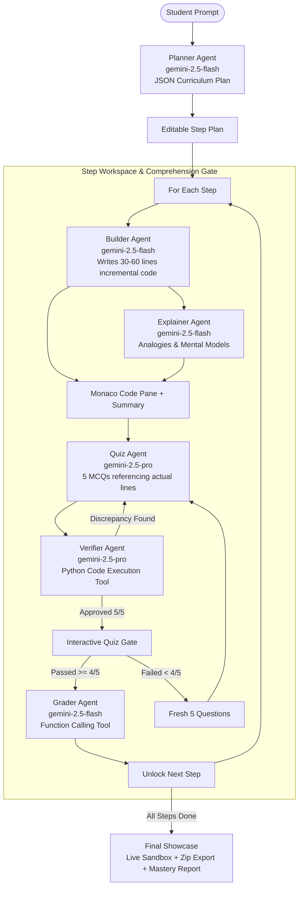

# ⚡ Grokked — Vibe Code with High Comprehension

> **Winner Concept for Google Gemini API Hackathon:**
> Students vibe code apps with AI, but to prevent *comprehension debt*, they must prove they understand each step through a verified 5-question code comprehension quiz before the next step unlocks.

---

## 🌟 The Problem & The Solution

- **The Problem: Comprehension Debt.** When students vibe-code with AI, they generate mountains of complex code that they cannot debug, explain, or recreate.
- **The Solution: Grokked.** An agentic learning platform where Gemini breaks an app down into 4–8 bite-sized steps (30–60 lines). At each milestone, you study the code and analogies in Monaco editor and must pass a **5-question MCQ gate** (scored ≥ 4/5) before the next step unlocks.

---

## 🤖 Multi-Agent Gemini Architecture

Grokked uses 6 discrete Gemini agents, each configured with specialized system instructions:



### 🧠 Gemini Features Visibly Showcased

1. **Structured Outputs (JSON Schema)**: Every agent utilizes `responseMimeType: "application/json"` with strict `responseSchema` definitions, validated with Zod on the server.
2. **Built-in Python Code Execution**: The **Verifier Agent** uses Gemini's `codeExecution: {}` tool to solve and compute algorithmic outputs blind, guaranteeing no flawed questions reach the student.
3. **Tool Use / Function Calling**: The **Grader Agent** invokes `updateConceptMastery` via function calling to update the per-concept mastery map (`red` / `yellow` / `green`) and the Comprehension Meter.
4. **Long Context Continuity**: The **Builder** and **Quiz** agents receive accumulated code from all prior steps to ensure coherent incremental development.
5. **Configurable Models via Environment Variables**:
   - `gemini-2.5-flash` for high-speed planning, building, and conceptual explanation.
   - `gemini-2.5-pro` for deep-reasoning quiz generation and zero-shot verification.
6. **Spaced Repetition**: Earlier weak concepts (`red` / `yellow`) are fed back into the Quiz agent to re-test retention.

---

## 🛠 Tech Stack

- **Framework**: Next.js 14 (App Router) + TypeScript
- **Styling**: Tailwind CSS + Custom Dark Theme Design System
- **Code Display**: Monaco Editor (`@monaco-editor/react`) with dynamic line range highlighting
- **Animations**: Framer Motion + Canvas Confetti
- **State Management**: Zustand with `localStorage` persistence
- **SDK**: Official `@google/genai` (Node.js server-side route handlers only)
- **Validation**: Zod with retry recovery loops
- **Export**: JSZip for complete client bundle download
- **Sandboxed Execution**: `iframe` with `sandbox="allow-scripts"` and dynamic `srcDoc`

---

## 🚀 Getting Started

### 1. Clone & Install Dependencies

```bash
git clone <repository-url>
cd Grokked
npm install
```

### 2. Configure Environment Variables

Copy `.env.example` to `.env.local`:

```bash
cp .env.example .env.local
```

Add your Google Gemini API key:

```env
GEMINI_API_KEY=your_gemini_api_key_here
MODEL_PLANNER=gemini-2.5-flash
MODEL_BUILDER=gemini-2.5-flash
MODEL_EXPLAINER=gemini-2.5-flash
MODEL_QUIZ=gemini-2.5-pro
MODEL_VERIFIER=gemini-2.5-pro
MODEL_GRADER=gemini-2.5-flash
```

### 3. Run the Development Server

```bash
npm run dev
```

Open [http://localhost:3000](http://localhost:3000) in your browser.

---

## ⚡ Demo Mode (Offline / Hackathon Showcase)

Grokked includes a complete, pre-generated **5-Step Todo & Flow Application**:
- Click **"Demo Mode"** in the top navigation bar or on the landing page.
- Loads complete plans, step code, explainer analogies, and 5 verified quiz questions per step.
- Works 100% offline with zero API keys or network latency for bulletproof live hackathon presentations!
